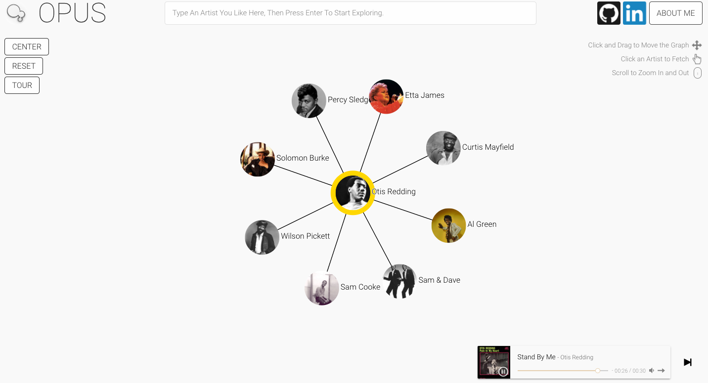

# Greenhouse

[Opus Live Link][heroku]

[heroku]: http://www.opusopus.co/

## Summary

Opus is an artist-exploration data-visualization application, built with the Spotify Web API and D3.js. Opus is built to help the user find their next favorite artist. First, the user chooses an artist. Opus then fetches that artist, that artist's top songs, and that artist's related artists from Spotify. It visualizes that data on the page with D3, and lets the user continue exploring by clicking on other artists.

Opus uses the following libraries, languages, technologies, and frameworks:
* JavaScript
* D3.js
* jQuery
* Express
* Node
* Heroku
* Sub-Libraries:
  * APlayer
  * Intro.js
  * Request

# How To Use Opus

### Artist Selection

The user can select an artist in two different ways.

The user will typically start by typing in an artist using the search bar on the top of the page. This will send an AJAX request to the Spotify API's Search endpoint, and return an array of artists to Opus. Opus will take the top result of that search and display it on the page with a yellow border. If there are other artists already on the page with a yellow border, Opus will make a connection between the newly fetched artist and those artists.

## Upcoming Features

There is still work to be done on Opus. The following is a list of features that still need implementation:

* Spotify Login
* Auto-recommendation with User Profile data
* Saving artists
* Generating playlist with saved artists
* Volume control
* Mute button
