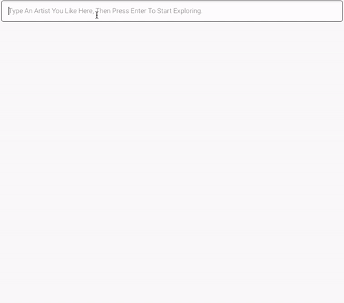
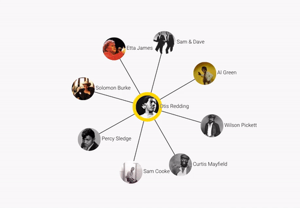
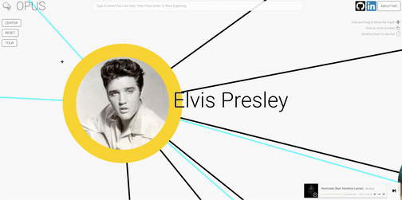
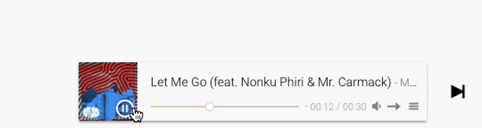

# Greenhouse

[Opus Live Link][heroku]

[heroku]: http://www.opusopus.co/

## Summary

Opus is an artist-exploration data-visualization application, built with the Spotify Web API and D3.js. Opus is built to help the user find their next favorite artist. First, the user chooses an artist. Opus then fetches that artist, that artist's top songs, and that artist's related artists from Spotify. It visualizes that data on the page with D3, and lets the user continue exploring by clicking on other artists. Have fun with it! Select artists you like and see what artists they all connect to. Select two artists that don't connect at all and try to find a connection between their related artists.

Opus uses the following libraries, languages, technologies, and frameworks:
* JavaScript
* D3.js
* jQuery
* Express
* Node
* Heroku
* Sub-Libraries:
  * APlayer
  * Intro.js
  * Request

 

# How To Use Opus

## Artist Selection

The user can select an artist in two different ways.

The user will typically start by typing in an artist using the search bar on the top of the page. This will send an AJAX request to the Spotify API's Search endpoint, and return an array of artists to Opus. Opus will take the top artist of that search and display it on the page with a yellow border. If there are other artists already on the page with a yellow border, Opus will make a connection between the newly fetched artist and those artists.

  

 

Once there are artists on the page, the user can then simply click on any artist on the page to fetch related artists and songs for that artist. The user can do this as much as they'd like.

  

 

## Force Graph Manipulation

The user can zoom in and zoom out using the scrollwheel, and move the graph back and forth by clicking and dragging the background. The user can drag the artists around as well.

  

 

If the graph grows too large, the user zooms too far in or out, or the graph goes off of the page, the user can reset the view using the Center button.

  

 

If the user wants to start over, they can press the Reset button.

 

## Playback

Playback is controlled at the bottom right.

  

 

# Upcoming Features

There is still work to be done on Opus. The following is a list of features that still need implementation:

* Spotify Login
* Auto-recommendation with User Profile data
* Saving artists
* Generating playlist with saved artists
* Volume control
* Mute button
* Graph saving
